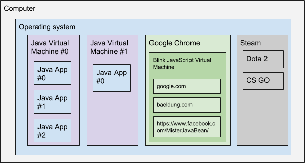
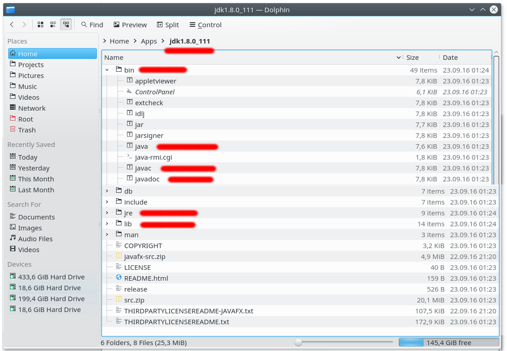

# Java

> Java technology is both a programming language and a platform.

The [Java](https://docs.oracle.com/javase/tutorial/getStarted/intro/definition.html) programming language is a high-level language where all source code is first written in plain text files ending with the `.java` extension. Those source files are then compiled into `.class` files by the javac compiler. A `.class` file does not contain code that is native to your processor; it instead contains bytecodes — the machine language of the Java Virtual Machine (Java VM). The java launcher tool then runs your application with an instance of the Java Virtual Machine.

### Java Virtual Machine

1. Java virtual machine is a software app, which acts as environment for java based applications which serve as a bridge between java bytecode language commands and operating system and vice-versa
1. [Here's what wiki says](https://en.wikipedia.org/wiki/Java_virtual_machine)
1. [JVM's Architecture explained](https://dzone.com/articles/jvm-architecture-explained?edition=213234&utm_source=Spotlight&utm_medium=email&utm_campaign=java%202016-09-13
)

There is a separated version of JVM for almost each operating system (_Linux, Mac, Windows, etc._). There are multiple implementations of JVM proposed by different vendors, Oracle being "the main mother".

### The Java Runtime Environment - JRE

Is a software distribution containing a stand-alone Java VM (most popular is HotSpot from Oracle), a browser plugin, the Java standard libraries and a configuration tool. It is the most common Java environment installed on Linux, Mac, Windows computers. It is freely available for download at the website java.com.

If we'll draw it, this could represent the text above:



### Java Development Kit (JDK)
The [JDK](http://www.oracle.com/technetwork/java/javase/jdk-8-readme-2095712.html) includes tools useful for developing and testing programs written in the Java programming language and running on the Java platform. Java Launcher (_java_), Java Compiler (_javac_), Java documenting tool (_javadoc_), Java Visual VM (_jvisualvm_), Java Control Panel (_jcontrol_), Java Mission Control (_jmc_), and many others.


Usually you can install the JDK only by extracting from .zip or .tgz archive, or by using the installer. The most common locations are: 
1. `C:\Program Files\Oracle\Java` 
1. `/opt/java/..`
1. `/usr/lib/jvm/..` 
1. `/Library/Java/JavaVirtualMachines/` 
1. `/System/Library/Java/JavaVirtualMachines/`

Example of a folder with JDK files inside



### Java

The `java` command line application starts a Java application. It does this by starting the Java Runtime Environment (JRE), loading the specified class, and calling that class's `main()` method. The method must be declared as `public` and `static`, it must not return any value, and it must accept a `String` array as a parameter. The method declaration has the following form:
```java
public class Hello {
    public static void main(String[] args) {
        System.out.println("¯\\_(ツ)_/¯");
    }
}
```

[java binary docs](http://docs.oracle.com/javase/8/docs/technotes/tools/windows/java.html)

[Example on YouTUBE](https://www.youtube.com/watch?v=zBF1M8dTftk)

### Javac Compiler

The `javac` command line application reads class and interface definitions, written in the Java programming language, and compiles them into bytecode class files. The javac command can also process annotations in Java source files and classes.
In real life, you’ll not use it directly, instead the Integrated Development Editor (IDE) or the build tools (maven, gradle, ant, etc.) will use it to compile .java to .class

[javac binary docs](http://docs.oracle.com/javase/8/docs/technotes/tools/windows/javac.html)

[Example on YouTUBE](https://www.youtube.com/watch?v=zBF1M8dTftk)

### Java Mission Control and Visual VM
- Java Mission Control (and Java Flight Recorder) together create a complete tool chain to continuously collect low level and detailed runtime information enabling after-the-fact incident analysis
- Java Visual VM is a simplified and older tool from same category

[docs](http://www.oracle.com/technetwork/java/javaseproducts/mission-control/java-mission-control-1998576.html)

## NEXT

[04. Variables](04-Variables.md)
